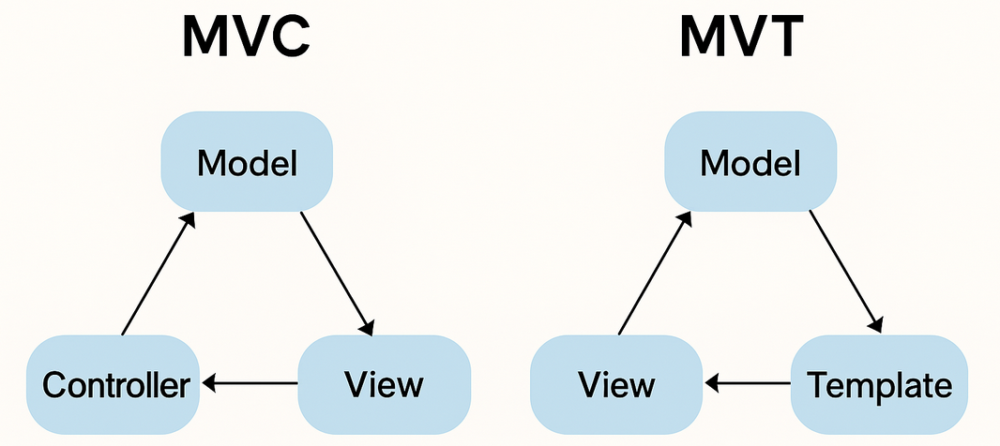
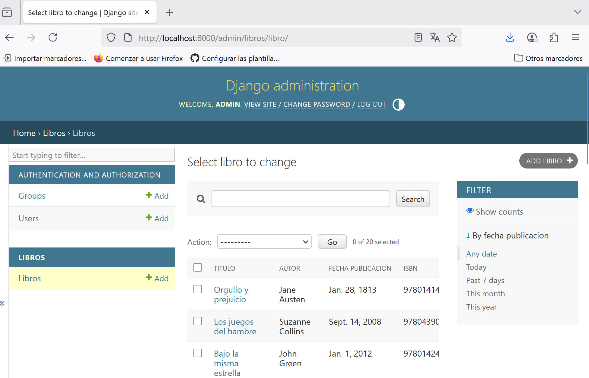

# Tarea: Investigación y Desarrollo de un CRUD con Django

## Parte 1: Aplicación CRUD y Django

### 1. ¿Qué es un CRUD y cuál es su propósito en el desarrollo de aplicaciones web?

CRUD es un acrónimo que representa las cuatro operaciones básicas que se pueden realizar sobre datos en una aplicación:

- **Create (Crear):** Añadir nuevos datos.
- **Read (Leer):** Consultar o visualizar datos existentes.
- **Update (Actualizar):** Modificar datos existentes.
- **Delete (Eliminar):** Borrar datos.

Django facilita la construcción de CRUDs con:
- Modelos (para la base de datos)
- Formularios (para entrada de datos)
- Vistas (para lógica de negocio)
- URLs y templates (para mostrarlo en la web)


**Propósito: en el desarrollo web** 
CRUD es una estructura fundamental en las aplicaciones web porque permite a los usuarios interactuar con la base de datos de forma completa y ordenada. Estas operaciones son la base de casi cualquier aplicación web dinámica, desde blogs hasta redes sociales o sistemas administrativos.


#### Ejemplo de aplicación CRUD: Gestor de contactos

Una app donde los usuarios pueden crear, ver, editar y eliminar información de contactos personales o profesionales.

| Operación | Acción |
|-----------|--------|
| Create | Añadir un nuevo contacto con nombre, teléfono, correo, etc. |
| Read   | Ver la lista de todos los contactos o buscar por nombre. |
| Update | Editar la información de un contacto existente. |
| Delete | Eliminar un contacto de la base de datos. |

---

### 2. ¿Qué son los patrones de arquitectura en desarrollo de software?

Son soluciones generales y reutilizables para organizar el código de una aplicación. Ayudan a separar responsabilidades, mejorar el mantenimiento del software, facilitar pruebas y fomentar una estructura clara.

#### Patrón MVC (Modelo–Vista–Controlador)

MVC es un patrón clásico y ampliamente usado. Divide la aplicación en tres componentes principales:

- **Modelo (Model):** Gestiona la lógica de datos, validaciones y conexión con la base de datos.
- **Vista (View):** Presenta los datos al usuario. Es la interfaz.
- **Controlador (Controller):** Maneja la lógica entre vista y modelo. Responde a las acciones del usuario y actualiza el modelo o la vista según sea necesario.

Ejemplo: En una app de tareas, el controlador decide qué tarea mostrar, el modelo obtiene los datos, y la vista los muestra.


#### Patrón MVT (Modelo–Vista–Template) – Usado por Django

MVT es una variante del patrón MVC, usada por Django. Se compone de:

- **Modelo (Model):** Igual que en MVC. Define los datos y cómo se almacenan.
- **Vista (View):** Lógica de negocio (elige qué datos mostrar). Toma decisiones, consulta modelos y devuelve respuestas.
- **Template (Template):** Plantilla HTML que que define cómo se muestra la información. Es como la "Vista" del patrón MVC.

**Diferencias entre MVC y MVT**

| Elemento   | MVC                | MVT (Django)         |
|------------|--------------------|-----------------------|
| Modelo     | Maneja los datos    | Igual                 |
| Vista      | Presenta datos (HTML)     | Lógica que decide qué mostrar |
| Controlador| Lógica del flujo    | Interno en Django     |
| Template   | No separado         | Encargado del HTML    |

En resumen:
**En Django, lo que en MVC sería el "Controlador", está integrado en el framework y lo que tú creas como "vista" en Django es en realidad el "controlador" en MVC.**

**¿Qué patrón usa Django?**
**Django usa el patrón MVT (Modelo–Vista–Template).**
Pero por su parecido con MVC, muchas veces se hace referencia cruzada entre ambos.


---

### 3. ¿Cómo se estructura un proyecto en Django?

Un proyecto Django sigue una estructura organizada que separa claramente la lógica de negocio, presentación y acceso a datos. Un proyecto puede tener múltiples apps, y cada app tiene responsabilidades específicas.

**Estructura básica de un proyecto Django**


```
mi_proyecto/
├── mi_proyecto/        # Configuración global
├── mi_app/             # App individual (modelos, vistas, templates, etc.)
|      ├── models.py
|      ├── views.py
|      ├── templates.py
|      ├── urls.py
├── manage.py
```

#### Componentes principales:

- **models.py:** Representan las estructuras de datos y definen cómo se almacenan en la base de datos.
- **views.py:** Contienen la lógica de negocio. Recuperan datos y devuelven respuestas (HTML, JSON, etc.).
- **templates/:** Archivos HTML con lógica ligera que muestran los datos al usuario.
- **urls.py:** Enrutan las peticiones del navegador hacia las vistas correspondientes.

#### Uso de %% en Django:

El sistema de plantillas de Django tiene su propia sintaxis para realizar operaciones como bucles, condiciones y mostrar datos dinámicos. Esta sintaxis se basa en el uso de etiquetas y filtros, que se indican con el carácter de porcentaje. Por ejemplo,  para una condición,  para un bucle, o {{ variable }} para mostrar una variable.

Cuando se necesita mostrar el carácter de porcentaje literal en una plantilla, por ejemplo, para mostrar un valor porcentual como "75%", se debe usar %%. Esto evita que Django interprete el porcentaje como el comienzo de una etiqueta o filtro.

Ejemplo: Si quisieramos mostrar el texto "El descuento es del 25%", deberíamos usar la siguiente sintaxis en nuestra plantilla:
```
<p>El descuento es del 25%%</p>
```
Sin el uso de %%, Django podría intentar interpretar "25%" como una etiqueta o filtro, lo que llevaría a un error o a un comportamiento inesperado.


---

### 4. ¿Cuál es el flujo de datos entre un formulario HTML y la base de datos en Django?

El flujo de datos entre un formulario HTML y la base de datos en Django sigue varios pasos coordinados. Este proceso es clave para capturar, validar y almacenar datos del usuario.

```
1. Usuario solicita el formulario (GET)
2. Usuario envía formulario (POST)
3. Vista valida (form.is_valid())
4. Guarda en DB (form.save())
5. Redirige a otra página (redirect)
```

#### Ejemplo:

```python
form = PostForm(request.POST)
if form.is_valid():
    form.save()
    return redirect('lista_posts')
```

---

### 5. ¿Qué herramientas o comandos ofrece Django para facilitar el desarrollo de un CRUD, para qué es cada una? (Por ejemplo: startapp, makemigrations, migrate, runserver, ModelForm, admin, etc.) 


**Herramientas y comandos útiles para CRUD en Django**

Django ofrece muchas herramientas y comandos integrados que facilitan enormemente el desarrollo de un CRUD (Create, Read, Update, Delete). Algunas de las más utilizadas, son las siguientes:

| Herramienta / Comando | Función |
|------------------------|---------|
| `startproject`         | Crea nuevo proyecto Django con la estructura |
| `startapp`             | Crea nueva app dentro del proyecto. Ideal para organizar funciones como un blog, foro, etc  |
| `makemigrations`       | Detecta cambios en tus modelos y crea archivos de migración para aplicarlos a la base de datos. |
| `migrate`              | Aplica las migraciones a la base de datos (crear/modificar tablas). |
| `runserver`            | Lanza un servidor web de desarrollo local para probar tu app. |
| `createsuperuser`      | Crea un usuario administrador para acceder al panel de administración de Django. |
| `ModelForm`            | Clase que permite crear formularios HTML automáticamente a partir de un modelo (útil para CRUDs). |
| `admin.site.register()`| Permite registrar modelos para gestionarlos en el panel de administración. |
| `render()`             | Función que devuelve una respuesta HTML con datos cargados en un template. |
| `redirect()`           | Redirige al usuario a otra vista tras realizar una acción (como guardar un modelo). |
| `get_object_or_404()`  | Función que busca un objeto por ID y devuelve error 404 si no existe (útil para editar/eliminar). |
| `shell`                | Probar consultas a la base de datos directamente en la consola. |
| `loaddata / dumpdata`  | Cargar o exportar datos en formato JSON. |
| `Django Debug Toolbar`   | Extensión muy útil para ver lo que pasa "bajo el capó" mientras desarrollas. |

---

### 6. ¿Cómo funciona el Admin de Django?

El **Admin de Django** es una interfaz web automática permite administrar el contenido de tu aplicación sin tener que escribir HTML, formularios ni vistas personalizadas. Es una de las grandes ventajas de Django, ideal para CRUD interno de modelos. Es generada automáticamente que lee los metadatos de los modelos para proporcionar una interfaz potente y lista para producción, donde los usuarios autorizados pueden gestionar el contenido del sitio.

Se basa en:

- Modelos registrados (`admin.site.register`)
- Clases de configuración `ModelAdmin`
- Sistema de autenticación y permisos de usuarios

Una vez que todo está configurado, Django genera paneles para:
- Crear, editar, eliminar y ver objetos de tus modelos.
- Administrar usuarios, grupos y permisos.
- Filtrar, ordenar y buscar registros fácilmente


**Ventajas del Admin de Django:**

- CRUD completo sin escribir templates 
- Panel intuitivo
- Control de acceso integrado
- Muy personalizable

**Importante:** El admin no está pensado como frontend para usuarios finales, sino como herramienta de administración interna. Para el usuario público se recomienda crear vistas personalizadas.

---

## Ejecución del Proyecto

Tras la ejecución de todos los pasos indicados en:

```
https://github.com/Factoria-F5-madrid/CRUD-django/
```
1. Obtendremos una imagen como la siguiente:



# Tarea_CRUD_Django-alfonso
